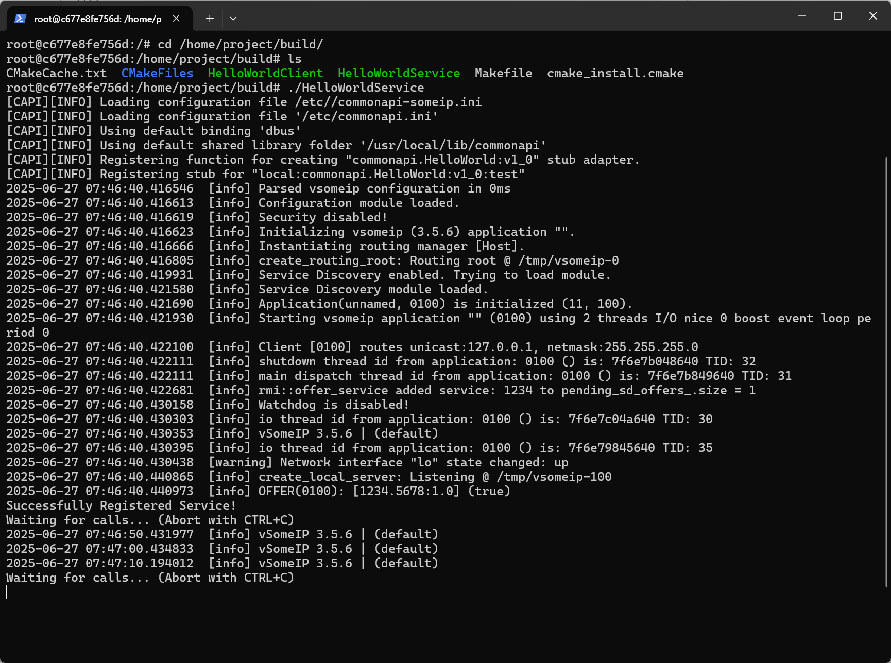
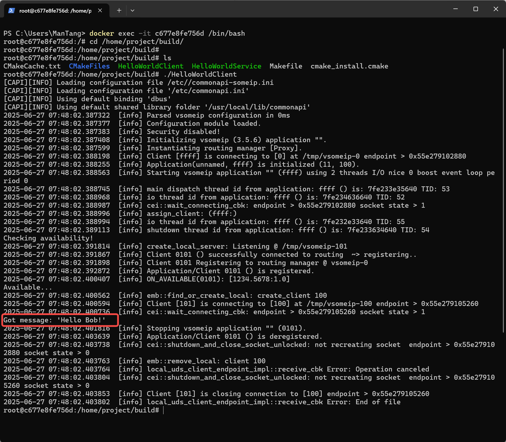
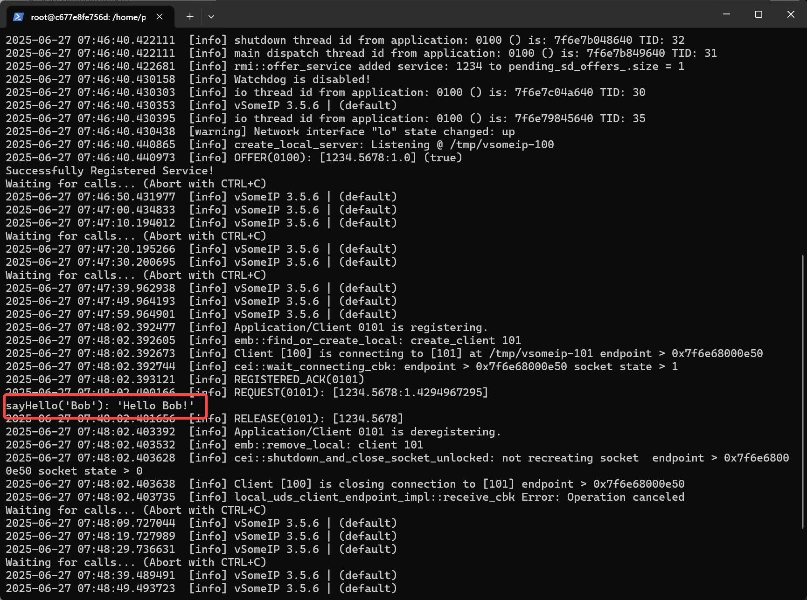

# CommonAPI C++ SOME/IP Demo Project

## Overview
This project demonstrates a basic implementation of CommonAPI with SOME/IP communication protocol, showing how to establish communication between a service (server) and client in a Linux environment.

## Environment Configuration
Two setup options available:

1. **Docker-based Setup** (Recommended)
2. **Manual Setup**

## Step 0: Quick Docker Setup
```bash
docker build -t commonapi-env:22.04 .
docker images | grep commonapi-env
docker run -it --rm commonapi-env:22.04 bash
```

## Step 1: Prerequisites Installation

```shell
apt update && apt install -y \
    build-essential \
    cmake \
    git \
    wget \
    unzip \
    tree \
    vim \
    default-jre \
    libboost-system-dev \
    libboost-thread-dev \
    libboost-log-dev
```

## Step 2: CommonAPI Environment Deployment

### 1. Install vsomeip Library

```shell
mkdir -p /home/vsomeip && cd /home/vsomeip
git clone https://github.com/COVESA/vsomeip.git
cd vsomeip && mkdir build && cd build
cmake -DENABLE_SIGNAL_HANDLING=1 ..
make -j$(nproc) && make install
```

### 2. Install capicxx-core-runtime

```shell
mkdir -p /home/CommonAPI_runtime && cd /home/CommonAPI_runtime
git clone https://github.com/GENIVI/capicxx-core-runtime.git
cd capicxx-core-runtime && mkdir build && cd build
cmake .. && make -j$(nproc) && make install
```

### 3. Install capicxx-someip-runtime

```shell
mkdir -p /home/CommonAPI_SOMEIP && cd /home/CommonAPI_SOMEIP
git clone https://github.com/GENIVI/capicxx-someip-runtime.git
cd capicxx-someip-runtime && mkdir build && cd build
cmake -DUSE_INSTALLED_COMMONAPI=OFF ..
make -j$(nproc) && make install
```

### 4. Install CommonAPI Core Generator

```shell
mkdir -p /home/CommonAPI_generator/commonapi-core-generator
cd /home/CommonAPI_generator/commonapi-core-generator
wget https://github.com/COVESA/capicxx-core-tools/releases/download/3.2.0.1/commonapi_core_generator.zip
unzip commonapi_core_generator.zip
chmod +x commonapi-core-generator-linux-x86_64
```

### 5. Install CommonAPI SOME/IP Generator

```shell
mkdir -p /home/CommonAPI_generator/commonapi-someip-generator
cd /home/CommonAPI_generator/commonapi-someip-generator
wget https://github.com/COVESA/capicxx-someip-tools/releases/download/3.2.0.1/commonapi_someip_generator.zip
unzip commonapi_someip_generator.zip
chmod +x commonapi-someip-generator-linux-x86_64
```

## Step 3: Demo Project Setup

### 1. Create Project Structure

```shell
mkdir -p /home/project/{fidl,src,build}
cd /home/project && touch CMakeLists.txt
cd fidl && touch HelloWorld.fidl HelloWorld.fdepl
cd ../src && touch HelloWorldClient.cpp HelloWorldService.cpp HelloWorldStubImpl.{hpp,cpp}
```

### 2. Generate Code

```shell
cd /home/project
/home/CommonAPI_generator/commonapi-core-generator/commonapi-core-generator-linux-x86_64 -sk ./fidl/HelloWorld.fidl
/home/CommonAPI_generator/commonapi-someip-generator/commonapi-someip-generator-linux-x86_64 -ll verbose ./fidl/HelloWorld.fdepl
```

## Step 4: Build and Run

### 1. Build Project

```shell
cd /home/project/build
cmake .. && make
```

### 2. Verify Dependencies

```shell
ldd ./HelloWorldClient
```

### 3. Fix Missing Library (if needed)

```shell
echo "/home/vsomeip/vsomeip/build" | sudo tee /etc/ld.so.conf.d/vsomeip.conf
sudo ldconfig
```

### 4. Run Applications

Terminal 1: Start the service

```shell
./HelloWorldService
```

Terminal 2: Start the client

```shell
./HelloWorldClient
```

### Expected Output

Successful communication will show:

- Service registering and handling requests
- Client connecting and receiving responses
- "Hello Bob!" message exchange







